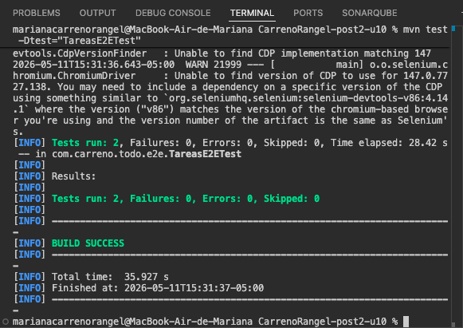
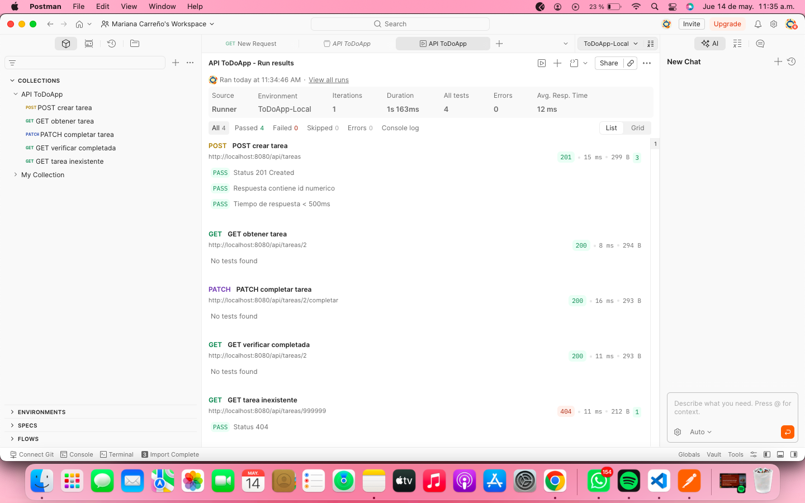
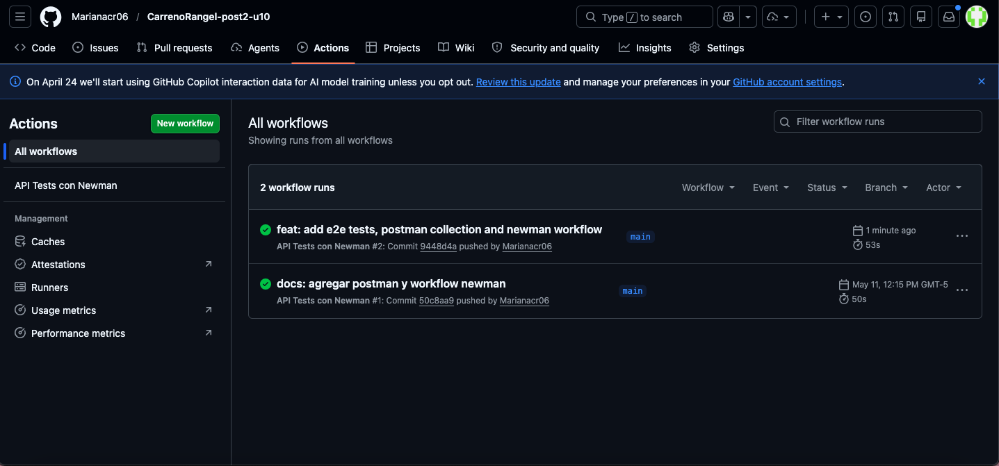

# CarrenoRangel-post2-u10

Pruebas E2E con Selenium (Page Object Model), Postman/Newman y GitHub Actions.

## Requisitos
- Java 17
- Maven 3.9+
- Google Chrome estable
- Node.js 18+ con npm
- Postman Desktop o Web

## Estructura del repositorio
├── src/
│   └── test/java/com/carreno/todo/e2e/
│       ├── TareasPage.java
│       ├── NuevaTareaPage.java
│       └── TareasE2ETest.java
├── postman/
│   ├── ColeccionToDo.json
│   ├── env-local.json
│   └── env-ci.json
├── .github/
│   └── workflows/
│       └── api-tests.yml
├── img/
│   ├── evidencia1-selenium.png
│   ├── evidencia2-postman.png
│   └── evidencia3-actions.png
└── README.md

---

## 1. Ejecutar la aplicación localmente

```bash
mvn spring-boot:run
```
La aplicación queda disponible en `http://localhost:8080`.

---

## 2. Ejecutar pruebas E2E con Selenium

Los tests corren en modo headless (sin ventana del navegador).

```bash
mvn test -Dtest=TareasE2ETest
```

Resultado esperado:
---

## 3. Ejecutar Newman localmente

Instalar Newman:
```bash
npm install -g newman
```

Ejecutar la colección:
```bash
newman run postman/ColeccionToDo.json --environment postman/env-local.json
```
---

## 4. Ejecutar en Postman Desktop

1. Importar `postman/ColeccionToDo.json` y `postman/env-local.json`
2. Seleccionar el entorno **ToDoApp-Local**
3. Clic derecho en la colección → **Run collection** → **Start run**

---

## 5. GitHub Actions

El workflow se ejecuta automáticamente en cada `push` y `pull_request`.

---

## Evidencias

### Evidencia 1 — Selenium en verde


### Evidencia 2 — Postman Runner con 0 failures


### Evidencia 3 — GitHub Actions passing

